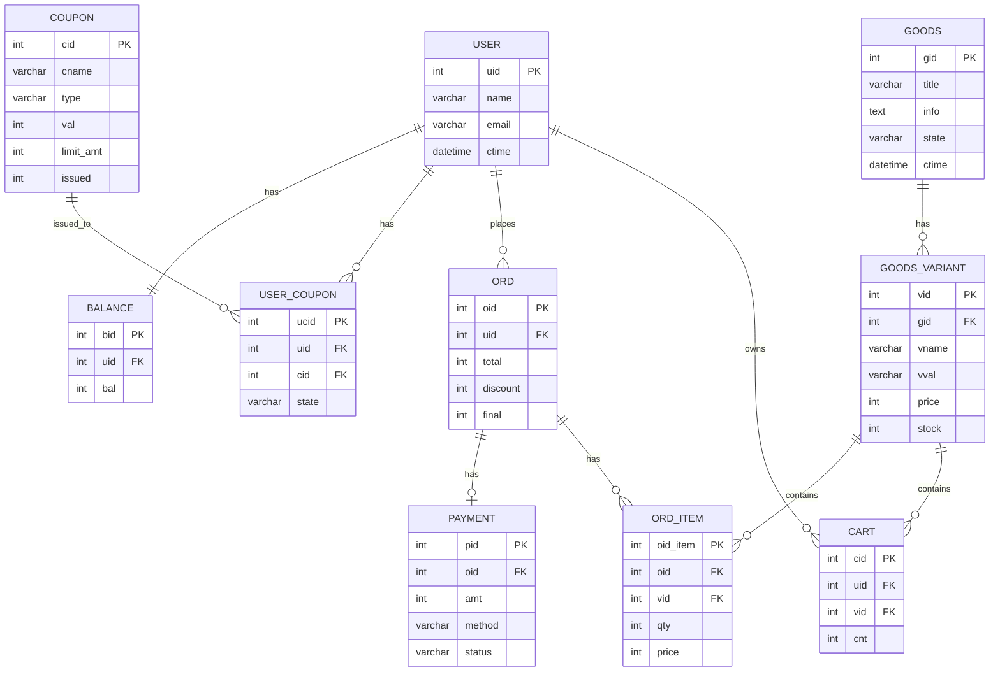

# 데이터 모델 (ERD)

## 테이블 정의

### GOODS 테이블 (상품)
```sql
CREATE TABLE GOODS (
    gid INT PRIMARY KEY AUTO_INCREMENT COMMENT '상품 ID',
    title VARCHAR(200) NOT NULL COMMENT '상품명',
    info TEXT COMMENT '상품 설명',
    state VARCHAR(15) NOT NULL DEFAULT 'ACTIVE' COMMENT '상품 상태',
    ctime DATETIME NOT NULL DEFAULT CURRENT_TIMESTAMP COMMENT '생성일시'
) ENGINE=InnoDB DEFAULT CHARSET=utf8mb4 COMMENT='상품';
```

### GOODS_VARIANT 테이블 (옵션)
```sql
CREATE TABLE GOODS_VARIANT (
    vid INT PRIMARY KEY AUTO_INCREMENT COMMENT '옵션 ID',
    gid INT NOT NULL COMMENT '상품 ID',
    vname VARCHAR(100) NOT NULL COMMENT '옵션명',
    vval VARCHAR(100) NOT NULL COMMENT '옵션값',
    price INT NOT NULL COMMENT '가격',
    stock INT NOT NULL DEFAULT 0 COMMENT '재고',
    FOREIGN KEY (gid) REFERENCES GOODS(gid) ON DELETE CASCADE
) ENGINE=InnoDB DEFAULT CHARSET=utf8mb4 COMMENT='상품 옵션';
```

### CART 테이블
```sql
CREATE TABLE CART (
    cid INT PRIMARY KEY AUTO_INCREMENT COMMENT '장바구니 ID',
    uid INT NOT NULL COMMENT '사용자 ID',
    vid INT NOT NULL COMMENT '옵션 ID',
    cnt INT NOT NULL DEFAULT 1 COMMENT '수량',
    UNIQUE KEY uk_user_variant (uid, vid),
    FOREIGN KEY (uid) REFERENCES USER(uid),
    FOREIGN KEY (vid) REFERENCES GOODS_VARIANT(vid)
) ENGINE=InnoDB DEFAULT CHARSET=utf8mb4 COMMENT='장바구니';
```

### ORD 테이블 (주문)
```sql
CREATE TABLE ORD (
    oid INT PRIMARY KEY AUTO_INCREMENT COMMENT '주문 ID',
    uid INT NOT NULL COMMENT '사용자 ID',
    total INT NOT NULL COMMENT '총액',
    discount INT NOT NULL DEFAULT 0 COMMENT '할인',
    final INT NOT NULL COMMENT '결제금액',
    FOREIGN KEY (uid) REFERENCES USER(uid)
) ENGINE=InnoDB DEFAULT CHARSET=utf8mb4 COMMENT='주문';
```

### ORD_ITEM 테이블 (주문 상품)
```sql
CREATE TABLE ORD_ITEM (
    oid_item INT PRIMARY KEY AUTO_INCREMENT COMMENT '주문 상품 ID',
    oid INT NOT NULL COMMENT '주문 ID',
    vid INT NOT NULL COMMENT '옵션 ID',
    qty INT NOT NULL COMMENT '수량',
    price INT NOT NULL COMMENT '단가',
    FOREIGN KEY (oid) REFERENCES ORD(oid) ON DELETE CASCADE,
    FOREIGN KEY (vid) REFERENCES GOODS_VARIANT(vid)
) ENGINE=InnoDB DEFAULT CHARSET=utf8mb4 COMMENT='주문 상품';
```

### PAYMENT 테이블
```sql
CREATE TABLE PAYMENT (
    pid INT PRIMARY KEY AUTO_INCREMENT COMMENT '결제 ID',
    oid INT NOT NULL COMMENT '주문 ID',
    amt INT NOT NULL COMMENT '금액',
    method VARCHAR(20) NOT NULL COMMENT '수단',
    status VARCHAR(15) NOT NULL DEFAULT 'PENDING' COMMENT '결제 상태',
    FOREIGN KEY (oid) REFERENCES ORD(oid) ON DELETE CASCADE
) ENGINE=InnoDB DEFAULT CHARSET=utf8mb4 COMMENT='결제';
```

### COUPON 테이블
```sql
CREATE TABLE COUPON (
    cid INT PRIMARY KEY AUTO_INCREMENT COMMENT '쿠폰 ID',
    cname VARCHAR(200) NOT NULL COMMENT '쿠폰명',
    type VARCHAR(10) NOT NULL COMMENT '타입',
    val INT NOT NULL COMMENT '할인값',
    limit_amt INT COMMENT '최대 할인',
    issued INT NOT NULL DEFAULT 0 COMMENT '발급수량'
) ENGINE=InnoDB DEFAULT CHARSET=utf8mb4 COMMENT='쿠폰';
```

### USER 테이블
```sql
CREATE TABLE USER (
    uid INT PRIMARY KEY AUTO_INCREMENT COMMENT '사용자 ID',
    name VARCHAR(100) NOT NULL COMMENT '이름',
    email VARCHAR(100) NOT NULL COMMENT '이메일',
    ctime DATETIME NOT NULL DEFAULT CURRENT_TIMESTAMP COMMENT '가입일시',
    UNIQUE KEY uk_email (email)
) ENGINE=InnoDB DEFAULT CHARSET=utf8mb4 COMMENT='사용자';
```

### USER_COUPON 테이블
```sql
CREATE TABLE USER_COUPON (
    ucid INT PRIMARY KEY AUTO_INCREMENT COMMENT '사용자 쿠폰 ID',
    uid INT NOT NULL COMMENT '사용자 ID',
    cid INT NOT NULL COMMENT '쿠폰 ID',
    state VARCHAR(15) NOT NULL DEFAULT 'ACTIVE' COMMENT '상태',
    FOREIGN KEY (uid) REFERENCES USER(uid),
    FOREIGN KEY (cid) REFERENCES COUPON(cid)
) ENGINE=InnoDB DEFAULT CHARSET=utf8mb4 COMMENT='사용자 쿠폰';
```

### BALANCE 테이블
```sql
CREATE TABLE BALANCE (
    bid INT PRIMARY KEY AUTO_INCREMENT COMMENT '잔액 ID',
    uid INT NOT NULL COMMENT '사용자 ID',
    bal INT NOT NULL DEFAULT 0 COMMENT '잔액',
    FOREIGN KEY (uid) REFERENCES USER(uid)
) ENGINE=InnoDB DEFAULT CHARSET=utf8mb4 COMMENT='사용자 잔액';
```

---

## ERD 다이어그램


